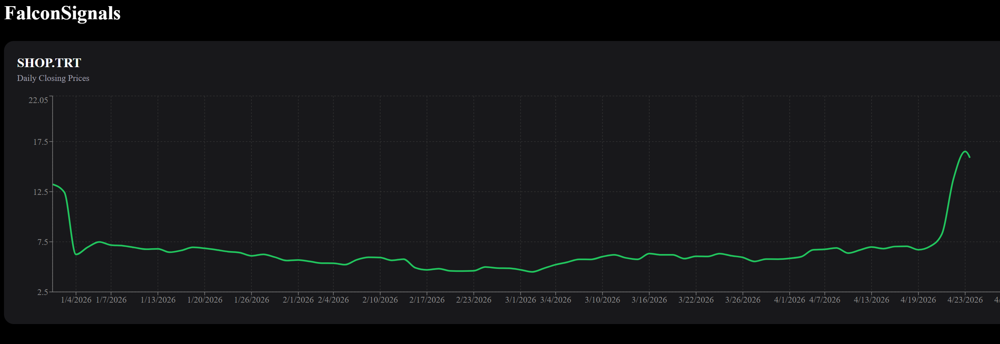

# Falcon Signals (In progress)

This is a full-stack stock market analysis platform built 
with ASP.NET Core, PostgreSQL, Next.js, and Entity Framework Core.
Falcon signals integrates real-time stock market data with Alpha Vantage API.

## Setup
1. Clone the repository
```aiignore
git clone https://github.com/femto21/FalconSignals.git
cd FalconSignals
```

2. Configure secrets
```
dotnet user-secrets init
```

3. Add your Alpha Vantage API key:
```aiignore
dotnet user-secrets set "AlphaVantage:ApiKey" "YOUR_API_KEY"
```

4. Add your PostgreSQL connection string:
```aiignore
dotnet user-secrets set "ConnectionStrings:DefaultConnection" "Host=localhost;Port=5432;Database=falconsignals;Username=postgres;Password=YOUR_PASSWORD"
```

5. Run migrations
```aiignore
dotnet ef database update
```

6. Run backend
```
dotnet run
```

7. Run frontend
```aiignore
cd signals-frontend
npm i
npm run dev
```

## Demo




